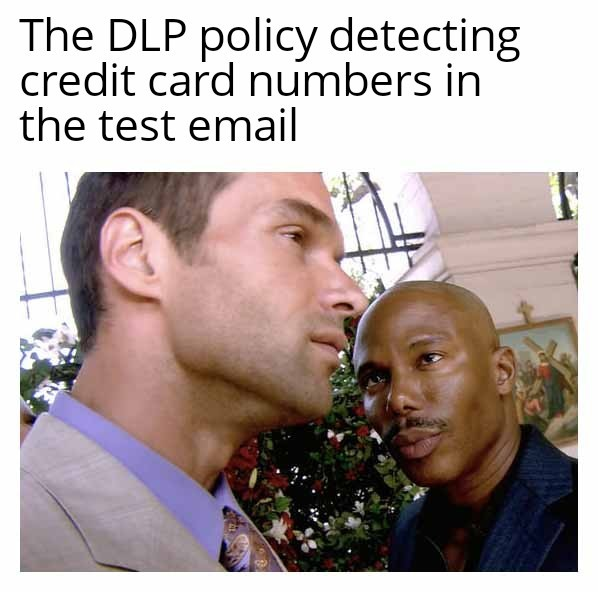
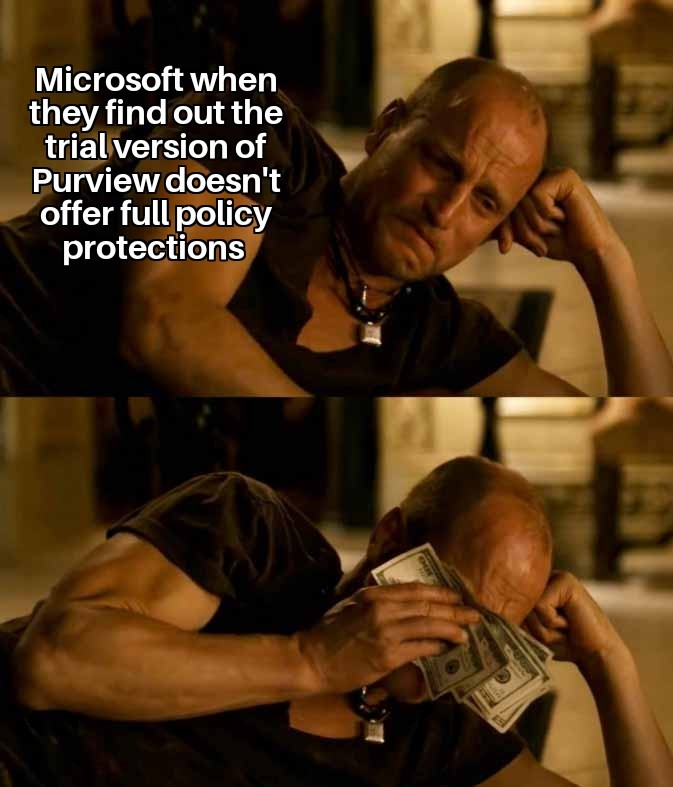

# Microsoft Purview DLP Lab
### U.S. Financial Data Protection Policy

---

## Table of Contents

- [Objective](#objective)
- [Lab Environment](#lab-environment)
- [What is DLP and Why It Matters](#what-is-dlp-and-why-it-matters)
- [Environment Setup](#environment-setup)
- [Policy Configuration](#policy-configuration)
- [Rule Design](#rule-design)
- [Policy Testing](#policy-testing)
- [Troubleshooting Log](#troubleshooting-log)
- [Trial Limitations](#trial-limitations)
- [Key Takeaways](#key-takeaways)
- [References](#references)

---

## Objective

The goal of this lab was to build hands-on experience with Microsoft Purview Data Loss Prevention by designing, deploying, and testing a DLP policy from scratch in a self-managed Microsoft 365 tenant. This lab was built to support preparation for data protection analyst roles and to demonstrate practical knowledge of DLP concepts, policy architecture, and incident response workflows.

---

## Lab Environment

| Component | Details |
|---|---|
| Platform | Microsoft Purview (New Portal) |
| Tenant | ZeroTrustBro2000.onmicrosoft.com |
| License | Microsoft 365 E3 Trial + Microsoft Purview Suite Trial |
| Admin Account | RaminDelsouz@zerotrustbro2000.onmicrosoft.com |
| Policy Name | ZeroTrustBro - U.S. Financial Data Protection Policy |
| Template Used | U.S. Financial Data |
| Locations Covered | Exchange Email, SharePoint Sites, OneDrive Accounts |

---

## What is DLP and Why It Matters

Data Loss Prevention is a set of technologies and policies that organizations use to detect and prevent the unauthorized sharing, transfer, or exposure of sensitive data. Whether the risk comes from a malicious insider, a phishing victim, or simple human error, DLP is the control layer that stands between sensitive data and the outside world.

In regulated industries like banking, healthcare, and finance, DLP is not optional. Regulations like PCI DSS, GLBA, and HIPAA require organizations to demonstrate that sensitive data is actively monitored and protected. A data protection analyst is responsible for configuring these policies, tuning them to reduce false positives, responding to alerts, and continuously improving the organization's data security posture.

---

## Environment Setup

### Step 1 — Microsoft 365 E3 Trial Tenant

A fresh Microsoft 365 E3 trial tenant was provisioned at [portal.office.com](https://portal.office.com) using a personal Microsoft account. During setup:

- **Company name:** ZeroTrustBro
- **Tenant domain:** zerotrustbro2000.onmicrosoft.com
- **Trial length:** 30 days (expires 6/28/2026)
- **License quantity:** 25 users

> **Note:** A credit card was required to start the trial but no charges occur until the trial expires. A reminder was set for 6/25/2026 to cancel before the billing date.

### Step 2 — Microsoft Purview Suite Trial

Initial attempts to access DLP features revealed that E3 alone did not include the full Purview compliance stack needed for enforcement. The Microsoft Purview Suite trial was activated from within the Purview portal under Activity Explorer, which prompted an upgrade option.

- **Product:** Microsoft Purview Suite Trial
- **License quantity:** 25
- **Total cost:** $0.00
- **Expiration:** 6/29/2026

### Step 3 — License Assignment

After activating the Purview Suite trial, the license was manually assigned to the admin user account. This is a critical step that is easy to miss — the license must be assigned to a user before it takes effect.

**Path:** Admin Center > Users > Active Users > Ramin Delsouz > Licenses and Apps > Check Microsoft Purview Suite > Save

---

## Policy Configuration

### Template Selection

The **U.S. Financial Data** template was selected from the Financial category. This template is designed to detect the presence of commonly recognized financial information in the United States.

**Sensitive info types included:**

| Info Type | Confidence Level | Instance Count (Low) | Instance Count (High) |
|---|---|---|---|
| Credit Card Number | High | 1 to 9 | 10 to Any |
| U.S. Bank Account Number | Medium | 1 to 9 | 10 to Any |
| ABA Routing Number | Medium | 1 to 9 | 10 to Any |

**Why U.S. Financial Data over other templates:**
The U.S. Financial Data template covers the broadest range of financial PII relevant to a U.S.-based organization. The other options (FTC Consumer Rules and GLBA) are more narrowly scoped to specific regulatory frameworks. For a lab demonstrating general DLP capability this was the most appropriate choice.

### Locations

The policy was applied to the following Microsoft 365 workloads:

| Location | Scope |
|---|---|
| Exchange Email | All groups |
| SharePoint Sites | All sites |
| OneDrive Accounts | All users and groups |

> **Note:** On-premises repositories was initially included but removed after it caused a sync error. This location requires additional infrastructure including the Microsoft Purview Information Protection scanner deployed on-premises, which was outside the scope of this cloud-based lab.

---

## Rule Design

### Why Two Rules?

A tiered rule approach is standard DLP practice. A single credit card number in an email could be accidental. A hundred credit card numbers in a single email is a potential data breach. The policy treats these scenarios differently.

---

### Rule 1 — Low Volume Detection

**Trigger:** 1 to 9 sensitive records detected in content shared externally

**Action:** Block only people outside the organization

**Rationale:** A low volume match is most likely accidental. Blocking external recipients prevents the data from leaving the organization while allowing internal users to continue accessing the content. A user notification is sent to educate the sender without disrupting internal workflows.

**Notifications sent to:**
- The person who sent, shared, or modified the content
- Owner of the SharePoint site or OneDrive account
- Owner of the SharePoint or OneDrive content

**Incident report severity:** Low

---

### Rule 2 — High Volume Detection

**Trigger:** 10 or more sensitive records detected in content shared externally

**Action:** Block everyone (internal and external)

**Rationale:** A high volume match suggests bulk data exfiltration — someone attempting to mass export customer financial records. At this threshold the appropriate response is to block access for all parties, including internal users, and escalate for investigation. This follows the principle of containment — when a potential breach is detected, the priority is to stop the bleeding first and investigate second.

**Notifications sent to:**
- The person who sent, shared, or modified the content
- Owner of the SharePoint site or OneDrive account
- Owner of the SharePoint or OneDrive content

**Incident report severity:** High

---

### Rule Comparison

| Setting | Low Volume Rule | High Volume Rule |
|---|---|---|
| Instance count trigger | 1 to 9 | 10 to Any |
| Block action | Block external only | Block everyone |
| Severity | Low | High |
| Use case | Accidental leak | Bulk exfiltration |

---

## Policy Testing

### Test Methodology

A simulated data exfiltration scenario was created by composing an email containing five publicly known test credit card numbers and sending it from the ZeroTrustBro tenant to an external Gmail address.

**Test credit card numbers used:**

| Card Type | Number |
|---|---|
| Visa | 4111111111111111 |
| Visa | 4012888888881881 |
| Mastercard | 5500005555555559 |
| American Express | 378282246310005 |
| Discover | 6011111111111117 |

> These are industry standard test card numbers published in developer documentation by Stripe and PayPal for sandbox payment testing. They pass Luhn algorithm checksum validation which is why DLP pattern matching detects them, but they are not linked to any real accounts or financial institutions.

**Email subject:** Customer Payment Information

### Test Result — Admin Notification Confirmed

On the first successful test, the following admin notification email was received:

> "Your email message conflicts with a policy in your organization. Issues:
> - Message is sent to people outside your organization.
> - Message contains the following sensitive information: Credit Card Number"

This confirmed the DLP policy successfully detected the sensitive financial data and triggered the notification workflow as configured.

*The DLP policy detecting credit card numbers in the test email*

### Test Result — Email Blocking

Due to trial tenant limitations detailed in the section below, full email blocking enforcement was not achieved during this lab. However the detection and alerting functionality was confirmed working. In a production E5 environment with fully propagated policies, the email would have been blocked from reaching the external recipient.

---

## Troubleshooting Log

This section documents the issues encountered during the lab and how they were resolved. Real-world DLP deployments involve troubleshooting licensing, permissions, and sync issues regularly — documenting this process is part of demonstrating genuine operational knowledge.

### Issue 1 — Initial Purview Access Limited on Work Account

**Symptom:** DLP was not visible in the Microsoft Purview solutions panel on the Log(N) Pacific work account.

**Root cause:** The work account license did not include the Purview compliance stack.

**Resolution:** Created a separate personal trial tenant to maintain full admin control and avoid touching the employer's production environment.

---

### Issue 2 — Developer Sandbox Not Available

**Symptom:** The Microsoft 365 Developer Program sandbox was unavailable with the message "You don't currently qualify."

**Root cause:** Microsoft tightened eligibility for the free dev sandbox, now requiring an active Visual Studio subscription.

**Resolution:** Used the Microsoft 365 E3 commercial trial instead.

---

### Issue 3 — Sync Error After Policy Creation

**Symptom:** Policy showed "Sync error" in the Policy sync status (preview) column immediately after creation.

**Root cause:** The On-premises repositories location was included in the initial policy configuration. This location requires the Microsoft Purview Information Protection scanner to be deployed on a physical or virtual on-premises server — infrastructure that does not exist in a cloud-only trial environment.

**Resolution:** Removed On-premises repositories from the policy locations. The policy was re-scoped to Exchange, SharePoint, and OneDrive only.

---

### Issue 4 — Block Actions Causing Persistent Sync Error

**Symptom:** After removing On-premises repositories, the sync error persisted when block actions were included in the rules.

**Root cause:** The "Restrict access or encrypt" block action requires E5 Compliance licensing. The E3 trial alone did not include sufficient licensing for enforcement actions.

**Resolution:** Temporarily removed block actions to confirm detection was working, then activated the Microsoft Purview Suite trial to unlock E5 Compliance features.

---

### Issue 5 — Purview Suite Trial Not Initially Available

**Symptom:** Attempting to activate the Microsoft Purview Suite trial returned "not eligible."

**Root cause:** Microsoft requires the E3 subscription to be active for a period before the Purview Suite add-on trial becomes available.

**Resolution:** Waited for the eligibility window to open, then activated the trial from within the Activity Explorer section of the Purview portal, which surfaced a direct trial activation prompt.

---

### Issue 6 — Purview Suite License Not Assigned to User

**Symptom:** E5 features remained unavailable after activating the Purview Suite trial.

**Root cause:** Activating a trial in the admin center provisions the licenses but does not automatically assign them to existing users. The license had to be manually assigned to the admin account.

**Resolution:** Navigated to Admin Center > Users > Active Users > selected the admin account > Licenses and Apps > checked Microsoft Purview Suite > saved changes.

*Me waiting for the policy to sync after several days and multiple policy rebuilds*

---

## Trial Limitations

This lab was conducted entirely within Microsoft trial subscriptions. The following limitations were encountered that would not exist in a production licensed environment:

| Limitation | Impact | Production Behavior |
|---|---|---|
| Policy sync status is a preview feature | Sync status showed errors that did not accurately reflect enforcement state | Stable sync reporting in production |
| New tenant propagation delays | Exchange transport rules can take 24+ hours to fully propagate on brand new tenants | Near real-time propagation on established tenants |
| E3 license without E5 Compliance | Block enforcement actions initially unavailable | Full enforcement available with E5 or Purview Suite license |
| Purview Suite trial eligibility window | Trial could not be activated immediately after E3 provisioning | Available immediately in production with proper licensing |
| Activity Explorer unavailable on E3 | Could not view detailed activity logs without E5 | Full activity logging and explorer available with E5 |

*Microsoft when they find out the trial version of Purview doesn't offer full policy protections*

---

## Key Takeaways

**DLP is not just about blocking.** Detection, alerting, and user education are equally important components. The admin notification email we received proving the policy detected credit card numbers is the foundation of a data protection analyst's daily workflow.

**Tiered rules reflect real-world risk assessment.** Treating a single credit card number differently from a bulk export of financial data is sound security thinking. Low severity events get user education. High severity events get containment.

**Confidence levels matter.** High confidence matching on credit card numbers uses checksum (Luhn algorithm) validation to reduce false positives. Medium confidence on bank account numbers and routing numbers casts a wider net but may require more tuning in production.

**Licensing drives capability.** Understanding what each license tier includes is a real operational skill. A data protection analyst needs to know why a policy isn't behaving as expected, and licensing is often the answer.

**New tenants behave differently than production.** Policy propagation delays, trial eligibility windows, and preview feature instability are all realities of working in a fresh environment. Patience and methodical troubleshooting are essential.

---

## References

- [Microsoft Purview DLP Overview](https://learn.microsoft.com/en-us/microsoft-365/compliance/dlp-learn-about-dlp)
- [Sensitive Information Types in DLP](https://learn.microsoft.com/en-us/microsoft-365/compliance/sensitive-information-type-learn-about)
- [DLP Policy Conditions, Exceptions, and Actions](https://learn.microsoft.com/en-us/microsoft-365/compliance/dlp-conditions-and-exceptions)
- [Stripe Test Card Numbers](https://stripe.com/docs/testing)
- [PayPal Developer Test Card Numbers](https://developer.paypal.com/api/nvp-soap/payflow/integration-guide/test-transactions/)
- [Microsoft 365 Licensing for Purview Compliance](https://learn.microsoft.com/en-us/office365/servicedescriptions/microsoft-365-service-descriptions/microsoft-365-tenantlevel-services-licensing-guidance/microsoft-365-security-compliance-licensing-guidance)

---

*Built by [@zerotrustbro](https://github.com/ramin61092) | [LinkedIn](https://linkedin.com/in/alireza-delsouz)*

